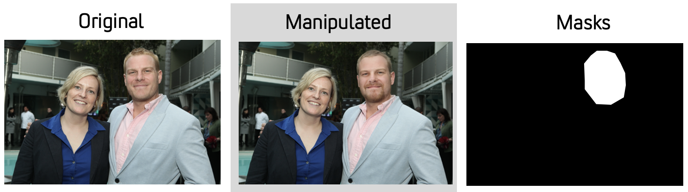

# Face Manipulation Datasets <!-- omit in toc -->
 

*[Comprehensive Dataset of Face Manipulations for Development and Evaluation of Forensic Tools.](face_manipulation_dataset.pdf)  
Brian DeCann (brian.decann@str.us), Kirill Trapeznikov (kirill.trapeznikov@str.us), Technical Report.*

- [CelebHQ-FM (Face Manipulations)](#celebhq-fm-face-manipulations)
  - [Evaluation Protocol](#evaluation-protocol)
  - [Download](#download)
- [FFHQ-FM (Face Manipulations) in-the-wild](#ffhq-fm-face-manipulations-in-the-wild)
  - [Evaluation Protocol](#evaluation-protocol-1)
  - [Download](#download-1)Brian DeCann (brian.decann@str.us), Kirill Trapeznikov (kirill.trapeznikov@str.us),
- [Contact](#contact)
- [References](#references)
- [Acknowledgment](#acknowledgment)

## CelebHQ-FM (Face Manipulations)

We compiled a dataset of edited portrait-style images. The image data was sourced from a subset of the [CelebA-HQ dataset](https://mmlab.ie.cuhk.edu.hk/projects/CelebA.html). In our subset, we only consider identities that appear at least twice (i.e., there are at least two images of a given identity) in the image data.

**Manipulation Model:** We applied the [Pivotal Tuning]() approach by Roich et al. to create each manipulated image [2].

We created two partitions of image data for training and testing purposes.  
- Training partition contains a total of 6,846 total images. 
- Each sampled CelebA-HQ image in the training partition is manipulated in five (5) separate instances, in combination with the original (unedited) image.
- Each sampled CelebA-HQ image is also paired with a separate (unedited) image of the same face identity as a reference. 
- The five manipulations consist of:
     - `smile` (smile added or enhanced)
     - `not smile` (smile removed or reduced)
     - `young` (face is modified to appear younger)
     - `old` (face is modified to appear older)
     - `surprised` (face is modified to include a surprised expression).  
- The testing partition contains a total of 7,644 images and 
     - includes the same types of manipulated images as in the training partition 
     - an additional seven manipulated images for a total of twelve images per identity (plus the original and a reference).
     - In the testing partition there are additional examples for `smile`, `not smile`, `young`, and `old`, where the edit magnitude is reduced.
     - In addition, there are three novel manipulations not present in the training partition.      
          - `purple_hair` (hair is modified to have a purple color)
          - `angry` (face is modified to depict an angry expression)
          - `Taylor Swift` (face shape and features modified to appear similar to Taylor Swift). 
     - Some identities may appear more than once in a given partition (training or testing), however an identity appearing in the training set will not appear in the testing set (and vice-versa). Both partitions are available in .png and .jpg format.

### Evaluation Protocol
For our portrait-style face manipulation dataset, we supply two challenges: detection and classification. A description of both challenges and associated outputs are described in the following sections.

- Detection: 
     - The objective of the detection experiment is to identify whether a given image has been manipulated. For a given image in the testing partition return: 
     - We measure balanced detection accuracy as the proportion of images that are correctly recognized as either edited or not edited.
- Classification
     - The objective of the classification experiment is to classify the type of edit in a manipulated image. For a given image in the testing partition return: 

### Download

|        | Train | Test |  
| ---    | ---   | ---  |  
| images | [train.zip](https://38cc41b1-f06c-4fbf-a324-696bb06cd45e.s3.amazonaws.com/face-manipulations-datasets/celebhq-fm/train.zip)    | [test.zip](https://38cc41b1-f06c-4fbf-a324-696bb06cd45e.s3.amazonaws.com/face-manipulations-datasets/celebhq-fm/test.zip) |  
| meta  | [train.csv](https://38cc41b1-f06c-4fbf-a324-696bb06cd45e.s3.amazonaws.com/face-manipulations-datasets/celebhq-fm/Train.csv) | [test.csv](https://38cc41b1-f06c-4fbf-a324-696bb06cd45e.s3.amazonaws.com/face-manipulations-datasets/celebhq-fm/Test_fixed.csv) |  

## FFHQ-FM (Face Manipulations) in-the-wild

We compiled a dataset of edited in-the-wild-style images. The image data was sourced from a subset of the [Flickr-Faces-HQ (FFHQ)](https://github.com/NVlabs/ffhq-dataset) [3].
- Our edited in-the-wild dataset consists of a randomly sampled subset of the 70,000 raw in-the-wild FFHQ images.
-  In our subset, we allow for the possibility that an image contains more than one person (face). This potentially adds an additional challenge in detecting and localizing edited faces. 

**Manipulation Model:** We adopt the approach from Tzaban et al. to inject edits to in-the-wild images [4]. Edits are localized to a region of the full-scene image. This is in contrast to the portrait-style face manipulation dataset, where images are fully synthesized from face-based GAN's.

We created two partitions of image data for training and testing (validation) purposes. 
- The training partition and test partition contain totals of 1,508 and 1,403 images, respectively.
- Within each partition, approximately 50\% of the images are edited, while the remaining images are `pristine` (i.e., not edited). 
- In the training partition, 759 images are edited and 750 are pristine.
-  For the testing partition, 652 images are edited and 750 are pristine.
-  All images are saved in .jpg format with a randomly chosen quality factor in the set $Q_f \in [75,80,85,90]$.
- Unlike the portrait-style images, each edited image is only subject to a single edit type. In other words, there are not multiple copies of the same underlying image but with different edits applied. 
- Images that are edited are subject to one of six possible manipulations. These include `smile`, `not_smile`, `young`, `old`, `male`, `female`. 
- For the images in the in-the-wild face manipulation dataset that are edited, we also provide a binary mask that captures the spatial image region where the edit was performed and transplanted back into the image. The edit region is identified using a modified BiSeNet for faces [5].

### Evaluation Protocol
We supply three challenges: detection, localization, and classification. A description of each challenge and outputs are described in the following sections.

- Detection
     - The objective of the detection experiment is to identify whether a given image has been manipulated.

- Localization
     - The objective of the localization experiment is to identify the specific image-region where an edit exists. 
     - For a given image in the testing partition, users must generate a binary mask, $\hat{M}$, denoting the estimated edit region. The estimated mask is compared against the ground truth, $M$ using Matthews Correlation Coefficient (MCC). 
     - The MCC (phi coefficient, or mean-square contingency coefficient) is a measure of association for binary variables. MCC is computed from the confusion matrix of the pixel-based binary estimations. This is mathematically described in Equation \eqref{eq:mcc}, where TP denotes True Positive ($M_k=\hat{M}_k=1$), TN denotes True Negative ($M_k=\hat{M}_k=0$), FP denotes False Positive ($M_k=0$, $\hat{M}_k=1$), and FN denotes False Negative ($M_k=1$, $\hat{M}_k=0$).
    - $MCC = \frac{TP\cdot TN - FP\cdot FN}{\sqrt{(TP+FP)(TP+FN)(TN+FP)(TN+FN)}}$

- Classification
     - The objective of the classification experiment is to classify the type of edit in a manipulated image.

>In our in-the-wild face manipulation dataset the types of edits that are present in the training partition are also represented in the testing partition. Similarly, the types of edits that are in the testing partition are also represented in the training partition. Thus, the classification problem for this dataset is `closed-set`. This is in contrast to the portrait-style data, where novel edit types exist in the testing partition. We encourage users utilizing this data and challenge problem to consider `open-set` solutions as the set of potential edit types is near-unlimited.

### Download

|        | Train | Test | Test (Diffusion Model) |
| ---    | ---   | ---  | --- |
| images | [train.zip](https://38cc41b1-f06c-4fbf-a324-696bb06cd45e.s3.amazonaws.com/face-manipulations-datasets/ffhq-fm/train_jpg.zip)    | [test.zip](https://38cc41b1-f06c-4fbf-a324-696bb06cd45e.s3.amazonaws.com/face-manipulations-datasets/ffhq-fm/test_jpg.zip) | [test_dm.zip](https://38cc41b1-f06c-4fbf-a324-696bb06cd45e.s3.amazonaws.com/face-manipulations-datasets/ffhq-fm/test_jpg_dm.zip) |
| meta  | [train.csv](https://38cc41b1-f06c-4fbf-a324-696bb06cd45e.s3.amazonaws.com/face-manipulations-datasets/ffhq-fm/Train_jpg_v0.csv) | [test.csv](https://38cc41b1-f06c-4fbf-a324-696bb06cd45e.s3.amazonaws.com/face-manipulations-datasets/ffhq-fm/Test_jpg_v0.csv) | [test-dm.csv](https://38cc41b1-f06c-4fbf-a324-696bb06cd45e.s3.amazonaws.com/face-manipulations-datasets/ffhq-fm/Test_jpg_dm_v0.csv)

## Contact

Kirill Trapeznikov kirill.trapeznikov@str.us  
Brian DeCann brian.decann@str.us  

## References
[1] C.-H. Lee, Z. Liu, L. Wu, and P. Luo. Maskgan: Towards diverse and interactive
facial image manipulation. In IEEE Conference on Computer Vision and Pattern
Recognition (CVPR), 2020.

[2] D. Roich, R. Mokady, A. H. Bermano, and D. Cohen-Or. Pivotal tuning for latent-
based editing of real images. arXiv preprint arXiv:2106.05744, 2021.

[3] T. Karras, S. Laine, and T. Aila. A style-based generator architecture for generative
adversarial networks. In Proceedings of the IEEE/CVF conference on computer vision
and pattern recognition, pages 4401–4410, 2019.

[4] R. Tzaban, R. Mokady, R. Gal, A. H. Bermano, and D. Cohen-Or. Stitch it in time:
Gan-based facial editing of real videos. arXiv preprint arXiv:2201.08361, 2022

[5] C. Yu, J. Wang, C. Peng, C. Gao, G. Yu, and N. Sang. Bisenet: Bilateral segmentation
network for real-time semantic segmentation. In Proceedings of the European conference
on computer vision (ECCV), pages 325–341, 2018

## Acknowledgment
*This material is based upon work supported by DARPA under Contract No. HR0011-20-C-0129. Any opinions, findings and conclusions or recommendations expressed in this material are those of the author(s) and do not necessarily reflect the views of DARPA.*

*DISTRIBUTION A. Approved for public release: distribution unlimited.*
